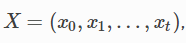
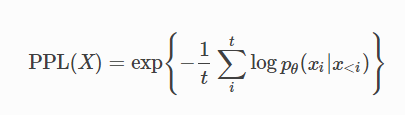
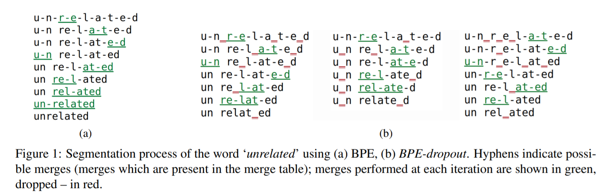

## BLEU

### Bilingual Evaluation Understudy

unigram用于衡量单词翻译的准确性，高阶n-gram用于衡量句子翻译的流畅性。实践中，通常是取N=1~4，然后对进行加权平均。**专注于精度**。

<table border-style=none>
    <tbody>
        <tr>
            <td></td>
            <td></td>
        </tr>
    </tbody>
</table>

```python
from nltk.translate.bleu_score import sentence_bleu
def sentence_bleu(
    references,
    hypothesis,
    weights=(0.25, 0.25, 0.25, 0.25),
    smoothing_function=None,
    auto_reweigh=False,
)
references = [["there", "is", "a", "cat", "on", "the", "table"]]
hypothesis = [ "a", "cat", "is", "on", "the", "table"]
bleu_1 = sentence_bleu(references, hypothesis, weights=(1, 0, 0, 0)) # exp(-1/6)
bleu_2 = sentence_bleu(references, hypothesis, weights=(0, 1, 0, 0)) # exp(-1/6)*3/5
bleu_4_avg = sentence_bleu(references, hypothesis) # 6.433932628423997e-78 --> 0 !!!

hypothesis = ["a", "a", "a", "a", "a", "a", "a"]
bleu_1 =  sentence_bleu(references, hypothesis, weights=(1, 0, 0, 0)) # 1/7 
```

## PPL

### (Perplexity 困惑度)

<div align=center> 
	
</div>
<div align=center> 
	
</div>

## Rouge 

### Recall-Oriented Understudy for Gisting Evaluation   

**(兼顾召回率和精度)**

Rouge-N & Rouge-L

```python
import os
import tempfile
import files2rouge


def write_file(write_path, content):
    f = open(write_path, 'w')
    f.write('\n'.join(content))
    f.close()


generated_corpus = [['i', 'love', 'i', '.', 'you', 'love', 'you'], ['i', 'want', 'you']]
reference_corpus = [['i', 'love', 'you', '.', 'you', 'love', 'me'], ['i', 'need', 'you']]

generated_corpus = [" ".join(generated_sentence) for generated_sentence in generated_corpus]
reference_corpus = [" ".join(reference_sentence) for reference_sentence in reference_corpus]

with tempfile.TemporaryDirectory() as path:
    generated_path = os.path.join(path, 'generated_corpus.txt')
    reference_path = os.path.join(path, 'reference_corpus.txt')
    write_file(generated_path, generated_corpus)
    write_file(reference_path, reference_corpus)

    files2rouge.run(
        summ_path=generated_path,
        ref_path=reference_path,
    )

Preparing documents... 0 line(s) ignored
Running ROUGE...
---------------------------------------------
1 ROUGE-1 Average_R: 0.75000 (95%-conf.int. 0.66667 - 0.83333)
1 ROUGE-1 Average_P: 0.75000 (95%-conf.int. 0.66667 - 0.83333)
1 ROUGE-1 Average_F: 0.75000 (95%-conf.int. 0.66667 - 0.83333)
---------------------------------------------
1 ROUGE-2 Average_R: 0.30000 (95%-conf.int. 0.00000 - 0.60000)
1 ROUGE-2 Average_P: 0.30000 (95%-conf.int. 0.00000 - 0.60000)
1 ROUGE-2 Average_F: 0.30000 (95%-conf.int. 0.00000 - 0.60000)
---------------------------------------------
1 ROUGE-L Average_R: 0.75000 (95%-conf.int. 0.66667 - 0.83333)
1 ROUGE-L Average_P: 0.75000 (95%-conf.int. 0.66667 - 0.83333)
1 ROUGE-L Average_F: 0.75000 (95%-conf.int. 0.66667 - 0.83333)

Elapsed time: 0.124 seconds
```

## Byte Pair Encoding (BPE)

```python
import re
import collections


def get_stats(vocab):
    pairs = collections.defaultdict(int)
    for word, freq in vocab.items():
        symbols = word.split()
        for i in range(len(symbols) - 1):
            pairs[symbols[i], symbols[i + 1]] += freq
    return pairs


def merge_vocab(pair, v_in):
    v_out = {}
    bigram = re.escape(' '.join(pair))
    p = re.compile(r'(?<!\S)' + bigram + r'(?!\S)')
    for word in v_in:
        w_out = p.sub(''.join(pair), word)
        v_out[w_out] = v_in[word]
    return v_out


vocab = {'l o w </w>': 5, 'l o w e r </w>': 2,
         'n e w e s t </w>': 6, 'w i d e s t </w>': 3}
num_merges = 10
for i in range(num_merges):
    pairs = get_stats(vocab)
    best = max(pairs, key=pairs.get)
    vocab = merge_vocab(best, vocab)
    print(best)
```

<div align=center> 
	
</div>